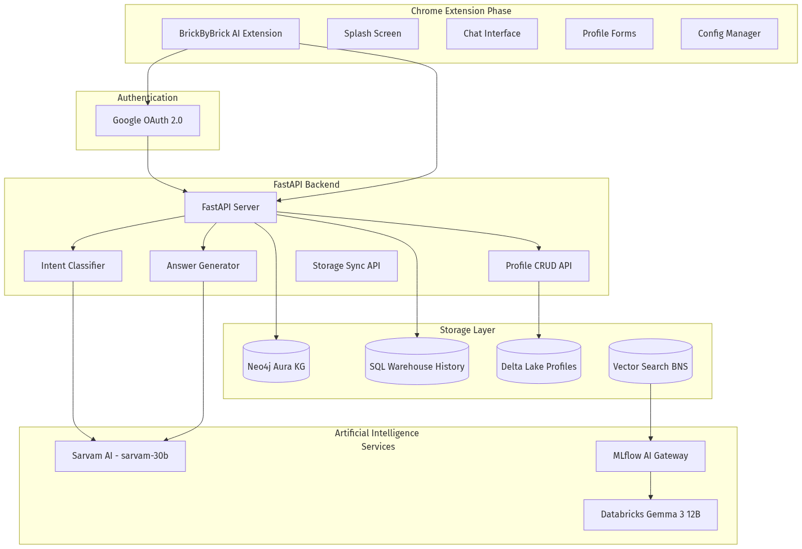
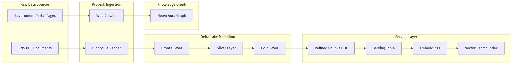
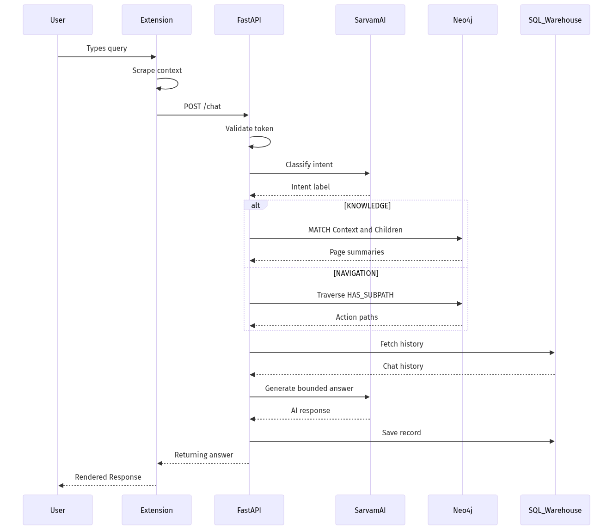
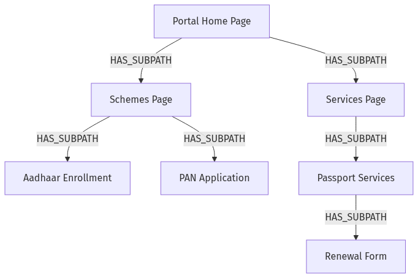

# BrickByBrick AI

> An intelligent, multilingual browser assistant that transforms the broken, frustrating experience of navigating Indian government portals into a seamless conversation — powered by Databricks, Neo4j, Sarvam AI, and PySpark Vector RAG.

[](https://databricks.com)
[](https://neo4j.com)
[](https://fastapi.tiangolo.com)
[](https://developer.chrome.com/docs/extensions/)

---

## Table of Contents

- [The Problem](#the-problem)
- [The Solution](#the-solution)
- [System Architecture](#system-architecture)
- [Data Pipeline Architecture](#data-pipeline-architecture)
- [Request Flow Architecture](#request-flow-architecture)
- [Component Deep-Dive](#component-deep-dive)
- [BNS Legal RAG Pipeline](#bns-legal-rag-pipeline)
- [Technology Stack](#technology-stack)
- [Project Structure](#project-structure)
- [Setup & Installation](#setup--installation)

---

## The Problem

Navigating government websites in India is notoriously difficult. For the average citizen, these portals are plagued with massive UX issues:

1. **Unintuitive Navigation**: Government sites often feature archaic, "dumb" layouts with circular links, endless menus, and deeply buried forms.
2. **Information Overload**: Finding the right scheme or legal act usually involves reading through dense, monolithic PDFs full of administrative jargon. 
3. **Language Barriers**: Information is predominantly available only in English or formal Hindi, alienating millions of citizens who communicate differently.
4. **Fragmented Workflows**: Completing a single task (like applying for a PAN card or tracking a passport application) often requires bouncing between multiple obscure portals.

These barriers prevent citizens from easily accessing the rights, schemes, and services they are entitled to.

---

## The Solution

**BrickByBrick AI** solves this by acting as a copilot right inside the user's browser via a Chrome extension side-panel. It bridges the gap between citizens and fragmented government infrastructure by combining:

- **Intent-Aware Routing**: Autonomously determines if a user wants general chat, specific knowledge, or step-by-step navigation help via Sarvam AI.
- **Knowledge Graph Navigation**: Traverses a Neo4j graph of government portal page hierarchies to provide contextual, accurate guidance without getting lost in dead links.
- **Multilingual Support**: Powered by Sarvam AI's `sarvam-30b` model, supporting natural conversations in Hindi and other Indian languages.
- **Vector RAG for Legal Documents**: Processes complex legal texts like the Bharatiya Nyaya Sanhita (BNS) into understandable chunks using a robust PySpark and Delta Lake pipeline.
- **Persistent Memory & Profiles**: Stores citizen profile data via Databricks SQL Warehouse with MERGE operations, and persists chat histories to save users from repeating themselves.

---

## System Architecture



---

## Data Pipeline Architecture



---

## Request Flow Architecture



---

## Component Deep-Dive

### Chrome Extension (Side Panel)
The extension operates as a Chrome side panel with non-blocking Google OAuth authentication. It features a modern chat interface with typing indicators, dynamic forms for profile management (personal details, address, identity documents), and capabilities to scrape the active page's context for in-context RAG answers.

### Intent Classification (Sarvam AI)
Every user query is intercepted and classified into a clear intent by `sarvam-30b`:
- **GENERAL**: Greetings or small talk (bypasses heavy retrieval).
- **KNOWLEDGE**: Informational queries seeking facts or definitions. Triggers retrieval of the current page summary and its direct children.
- **NAVIGATION**: Action-oriented queries ("How to apply..."). Triggers a deeper graph traversal to find actionable leaf pages.

### Neo4j Knowledge Graph
The graph models the confusing web of government portals logically.



Each Page node contains the full page URL, an AI-generated page summary, and a boolean flag (`is_leaf`) denoting if it represents an actionable endpoint.

### Databricks SQL Warehouse
Used for two critical data stores:
1. **Conversation History** (`extension_chat_history`): Persists session histories for multi-turn conversational context.
2. **User Profile Tables**: Centralized storage mapping to schemas like `personal_details` or `identity_documents`. Handled via MERGE upserts keyed on the user's email.

---

## BNS Legal RAG Pipeline

The Bharatiya Nyaya Sanhita (BNS) pipeline makes sense of dense legal PDFs by converting them into a searchable vector index using a Medallion architecture:

- **Ingestion**: PySpark `binaryFile` reader ingests raw PDF bytes into a Bronze Delta table.
- **Parsing**: `ai_parse_document` (v2.0) extracts structured text (elements, titles, content) into a Silver table.
- **Chunking**: `ai_prep_search` followed by a PySpark UDF (`split_text`) breaks text into reliable 1200-character chunks with a 200-character overlap for the Serving table.
- **Indexing & Retrieval**: Databricks Vector Search runs a Delta Sync index over the Serving table using `databricks-gte-large-en` embeddings.
- **Generation**: Questions are answered by `databricks-gemma-3-12b` via the MLflow AI Gateway using the retrieved context.

---

## Technology Stack

| Layer | Technology | Purpose |
|-------|-----------|---------|
| **Frontend** | Chrome Extension | Side-panel UI rendering |
| **Backend** | FastAPI + Uvicorn | REST API server on Databricks Apps |
| **LLM (Multilingual)** | Sarvam AI (`sarvam-30b`) | Intent classification & responses |
| **LLM (Legal QA)** | Databricks Gemma 3 12B | BNS legal RAG via MLflow Gateway |
| **Knowledge Graph** | Neo4j Aura | Portal hierarchy tracking |
| **Databases** | Databricks SQL Warehouse | Persistent chats, Delta Lake profiles |
| **Data Processing** | PySpark | Document ingestion, text chunking |
| **Databricks Native** | `ai_parse_document` | Vector Search, Indexing, Embeddings |
| **Auth & Routing** | Google OAuth 2.0 | Centralized identity |

---

## Project Structure

```text
BrickByBrick/
├── anysite-ai-extension/        # Chrome Extension (Side Panel)
│   ├── manifest.json            # Manifest V3 configuration
│   ├── config.js                # Backend URL & PAT configuration
│   ├── bg.js                    # Background service worker (OAuth)
│   ├── popup.html / ui.js       # UI elements and API handlers
│
├── backend/
│   └── main.py                  # FastAPI server (chat, sync, profile APIs)
│
├── BNS/BNS/                     # Databricks Notebooks
│   ├── 00_project_setup.sql     # Schema, volumes, bronze table creation
│   ├── 01_data_ingestion.py     # Pipeline: ingest -> parse -> chunk -> index
│   └── 02_bns_chatbot.py        # RAG chatbot logic
│
├── crawler/                     # Web crawler for Neo4j graph population
├── app.yaml                     # Databricks Apps deployment config
└── requirements.txt             # Python dependencies
```

---

## Setup & Installation

### Prerequisites
- Databricks Workspace with SQL Warehouse
- Neo4j Aura instance
- Sarvam AI API key
- Google OAuth 2.0 client ID

### Backend Setup

```bash
pip install -r requirements.txt

# Export environment variables
export DATABRICKS_SERVER_HOSTNAME="your-hostname.cloud.databricks.com"
export DATABRICKS_HTTP_PATH="/sql/1.0/warehouses/your-warehouse-id"
export DATABRICKS_TOKEN="your-databricks-token"
export SARVAM_API_KEY="your-sarvam-api-key"
export NEO4J_URI="neo4j+s://your-instance.databases.neo4j.io"
export NEO4J_USERNAME="neo4j"
export NEO4J_PASSWORD="your-password"

uvicorn backend.main:app --host 0.0.0.0 --port 8000
```

### Extension Setup
1. Visit `chrome://extensions/` and enable **Developer mode**.
2. Click **Load unpacked** and select the `anysite-ai-extension/` directory.
3. Make sure `config.js` points to your backend URL.

### BNS Pipeline Setup
1. Upload legal PDFs to your raw Databricks volume path.
2. Execute notebooks strictly in order: `00_project_setup.sql` -> `01_data_ingestion.py` -> `02_bns_chatbot.py`.
3. Wait for the index status to hit `ONLINE_NO_PENDING_UPDATE` before querying.

---

<p align="center">
  <strong>Built with ❤️ for Digital India</strong><br/>
  <em>Empowering citizens with AI-powered government portal navigation</em>
</p>
